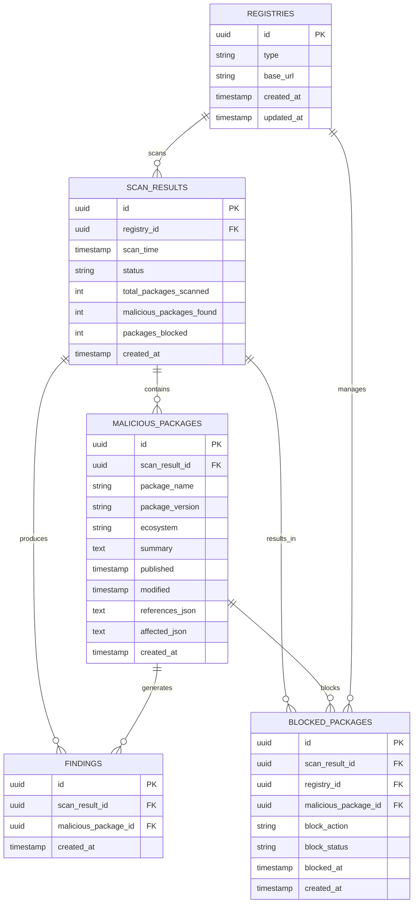

# Contributing to Malifiscan

Thank you for your interest in contributing to Malifiscan! This guide provides information for developers who want to contribute to or extend the project.

## 🏗️ Architecture

The application follows Clean Architecture principles with clear separation of concerns:

```
src/
├── core/                   # Business logic & entities
│   ├── entities/          # Domain models (MaliciousPackage, ScanResult)
│   ├── usecases/          # Application logic (SecurityScanner)
│   └── interfaces/        # Abstract service contracts
├── providers/             # External service implementations
│   ├── feeds/            # OSV feed provider
│   ├── registries/       # JFrog Artifactory provider
│   ├── notifications/    # Notification providers
│   └── storage/          # File/Database storage providers
├── factories/            # Dependency injection factories
├── config/              # Configuration management
├── scheduler/           # Periodic task scheduling
└── main.py             # Application entry point
```

## 🚀 Development Setup

### Installation

#### Option 1: Using UV (Recommended for Development)

UV provides faster dependency resolution and better development experience.

1. **Install UV** (if not already installed)
2. **Clone and setup the project**
   ```bash
  git clone <repository-url>
  cd malifiscan
   
   # Initialize UV project
   uv init --no-readme --no-pin-python
   
   # Install all dependencies (including dev dependencies)
   uv sync --dev
   ```

3. **Configure the application**
   ```bash
   # Create .env file from example (if available) or create new one
   cp .env.example .env  # Edit .env with your JFrog details after copying it.
   ```

#### Option 2: Using pip (Traditional)

1. **Clone the repository**
   ```bash
  git clone <repository-url>
  cd malifiscan
   ```

2. **Setup Python environment**
   ```bash
   # Create virtual environment
   python -m venv venv
   source venv/bin/activate  # On Windows: venv\Scripts\activate
   
   # Upgrade pip
   pip install --upgrade pip
   
   # Install dependencies
   pip install -r requirements.txt
   ```

3. **Configure the application**
   ```bash
   # Create .env file from example (if available) or create new one
   cp .env.example .env  # Edit .env with your JFrog details after copying it.
   ```

#### Verification

After installation, verify everything works:

```bash
# Using UV
uv run python cli.py config init    # Initialize configuration
uv run python cli.py config validate  # Verify setup
uv run python cli.py health check   # Test services

# Using pip/venv (activate environment first)
source venv/bin/activate
python cli.py config init           # Initialize configuration
python cli.py config validate       # Verify setup
python cli.py health check          # Test services
```

## ⚙️ Configuration

### Layered Configuration System

Malifiscan uses a layered configuration approach for maximum flexibility:

**Configuration Priority (highest to lowest):**
1. CLI arguments
2. Environment variables (`.env` file or system environment)
3. Local config file (`config.local.yaml` - user-specific, gitignored)
4. Project config file (`config.yaml` - defaults, committed to Git)
5. Built-in defaults

### Configuration Management Commands

```bash
# Initialize local configuration files from templates
python cli.py config init

# View current configuration from all sources
python cli.py config show

# Validate configuration and check for issues
python cli.py config validate
```

### Configuration Files

#### Environment Variables (.env)

Contains sensitive credentials and runtime settings:

```bash
# JFrog Configuration (Required)
JFROG_BASE_URL=https://your-company.jfrog.io/artifactory
JFROG_API_KEY=your-api-key

# Optional Configuration
SCANNER_INTERVAL_HOURS=1
LOG_LEVEL=INFO
DEBUG=false
```

#### Local Configuration (config.local.yaml)

Your personal overrides (gitignored, won't be committed):

```yaml
# Development settings
debug: true
environment: development

# Service overrides
packages_registry:
  enabled: true
  config:
    timeout_seconds: 60

# Custom storage
storage_service:
  type: file
  config:
    data_directory: "my_scan_results"
```

#### Base Configuration (config.yaml)

Project-wide defaults (committed to Git, shared by all developers):

```yaml
packages_feed:
  type: osv
  enabled: true

packages_registry:
  type: jfrog
  enabled: false  # Disabled by default

storage_service:
  type: database
  enabled: true
```

### Configuration Best Practices

- **Never commit secrets**: Use `.env` or `config.local.yaml` for sensitive data
- **Use local overrides**: Customize settings in `config.local.yaml` instead of modifying `config.yaml`
- **Environment-specific configs**: Use environment variables for deployment-specific settings
- **Validate regularly**: Run `python cli.py config validate` to catch configuration issues early

## 🔄 Development Workflow

### Using UV (Recommended)

UV provides a faster and more reliable development experience:

```bash
# Initial setup (after cloning)
uv init --no-readme --no-pin-python
uv sync --dev

# Run the application
uv run python cli.py health check
uv run python cli.py scan crossref

# Quick testing during development
uv run pytest tests/ -m "not integration"        # Fast feedback loop
uv run pytest tests/ -m integration              # Comprehensive testing

# Install additional dev dependencies
uv add --dev black isort flake8

# Run linting/formatting
uv run black src/ tests/
uv run isort src/ tests/
uv run flake8 src/ tests/

# Sync dependencies after changes
uv sync --dev
```

### Using pip/venv (Traditional)

```bash
# Activate environment (always required)
source venv/bin/activate

# Run the application
python cli.py health check
python cli.py scan crossref

# Run tests
pytest tests/ -m "not integration"  # Unit tests
pytest tests/ -m integration       # Integration tests

# Install additional dependencies
pip install black isort flake8

# Update requirements
pip freeze > requirements.txt
```

## 🧪 Testing

### Overview
The project uses co-located unit tests (next to source under `src/`) plus broader integration tests under `tests/integration/`. See below for database-specific strategy and execution examples.

### Database (SQLite) Testing Best Practices

| Layer | Location | Purpose | Scope |
|-------|----------|---------|-------|
| Unit  | `src/providers/storage/database_storage_test.py` | Validate ORM mapping & CRUD logic | Direct `DatabaseStorage` calls |
| Integration | `tests/integration/test_database_integration.py` | End-to-end flow through use cases | `ScanResultsManager` + real storage |

Key practices:
* Use `DatabaseStorage(database_path=":memory:", in_memory=True)` for fast isolation.
* In-memory engine uses a StaticPool internally so multiple sessions share state.
* Avoid mocking SQLAlchemy internals—assert behavior via the storage interface.
* For new persistence features: write a unit test first, then an integration test.
* Promote fixtures to `conftest.py` only after repeated reuse.
* Use file-backed DB only for manual debugging.

Edge cases to cover:
1. Empty result sets
2. Duplicate scan insert (update semantics)
3. Limit & filtering logic (`limit`, `scan_id`)
4. Malicious package & findings relationship integrity
5. Health checks and error wrapping into `StorageError`

### Running Tests

Using UV (recommended):
```bash
uv run pytest tests/                    # All tests
uv run pytest tests/ -m "not integration"  # Unit tests
uv run pytest tests/ -m integration     # Integration tests
uv run pytest tests/ --cov=src --cov-report=html
```

Using pip / venv:
```bash
pytest tests/                           # All tests
pytest tests/ -m "not integration"      # Unit tests
pytest tests/ -m integration            # Integration tests
pytest tests/ --cov=src --cov-report=html
```

### Command Options Reference
Common CLI scan options used in tests and examples:

- `--hours`: Time window (default 48)
- `--ecosystem`: Package ecosystem (npm, pypi, etc.)
- `--limit`: Max packages to process
- `--debug`: Enable verbose logging

### Adding New Tests
1. Co-locate file: `*_test.py` next to implementation.
2. Use descriptive test method names.
3. Prefer real entities over bare mocks where feasible.
4. Keep assertions focused—one behavior per test.
5. Fail fast on unexpected side effects (e.g., extra DB rows).


### Running Tests

We use a **co-located test structure** where tests are placed next to their source files with a `_test.py` suffix.

#### Using UV (Recommended for Development)

```bash
# Direct UV commands
uv run pytest tests/                              # All tests
uv run pytest tests/ -m "not integration"        # Unit tests only
uv run pytest tests/ -m integration              # Integration tests only

# Run with coverage
uv run pytest tests/ --cov=src --cov-report=html

# Run tests for a specific module
uv run pytest src/core/usecases/security_scanner_test.py

# Run specific test method
uv run pytest src/core/usecases/security_scanner_test.py::TestSecurityScanner::test_execute_scan_success

# Run all tests in a directory
uv run pytest src/core/entities/

# Check test coverage for use cases
uv run pytest src/core/usecases/ --cov=src/core/usecases --cov-report=term-missing
```

#### Using pip/venv (Traditional)

```bash
source venv/bin/activate  # Activate environment first

# Run all tests (including co-located tests)
pytest src/

# Run with coverage
pytest src/ --cov=src --cov-report=html

# Run only integration tests  
pytest tests/integration/

# Run tests for a specific module
pytest src/core/usecases/security_scanner_test.py

# Run specific test method
pytest src/core/usecases/security_scanner_test.py::TestSecurityScanner::test_execute_scan_success

# Run all tests in a directory
pytest src/core/entities/

# Check test coverage for use cases
pytest src/core/usecases/ --cov=src/core/usecases --cov-report=term-missing
```

### Writing Tests

When adding new functionality, create test files using these conventions:

1. **File Naming**: Use `*_test.py` suffix (e.g., `my_module_test.py`)
2. **Location**: Place test files in the same directory as the source code
3. **Imports**: Use absolute imports from project root
4. **Fixtures**: Define module-specific fixtures in test files, global fixtures in `conftest.py`

Example test file structure:
```python
# src/core/usecases/my_usecase_test.py

import pytest
from unittest.mock import AsyncMock

from src.core.usecases.my_usecase import MyUseCase
from src.core.entities import SomeEntity

class TestMyUseCase:
    """Test suite for MyUseCase."""
    
    @pytest.fixture
    def mock_dependency(self):
        """Mock external dependency."""
        return AsyncMock()
    
    @pytest.fixture
    def use_case(self, mock_dependency):
        """Create use case instance with mocked dependencies."""
        return MyUseCase(dependency=mock_dependency)
    
    @pytest.mark.asyncio
    async def test_some_operation(self, use_case):
        """Test some operation."""
        # Test implementation
        pass
```

## 🗄️ Database Schema (ERD)

The application uses a normalized SQLite database schema with the following entities and relationships:



### Key Design Principles

1. **Normalized Structure**: Separate tables for different entity types to eliminate data duplication
2. **Registry Tracking**: Each scan is associated with a specific registry to support multi-registry environments
3. **Flexible Findings**: Findings can be associated with both scan results and specific malicious packages
4. **Audit Trail**: All tables include creation timestamps for audit purposes
5. **Foreign Key Relationships**: Proper referential integrity between related entities
6. **UUID Primary Keys**: All tables use UUID (version 4) primary keys for security and scalability
7. **Simplified Findings**: FINDINGS table stores basic detection info; detailed vulnerability data (severity, description, remediation) is fetched on-demand via OSV API for better UX

### Table Descriptions

- **REGISTRIES**: Stores package registry configurations (JFrog, etc.) with registry type and base URL
- **SCAN_RESULTS**: Records of security scans performed on registries
- **MALICIOUS_PACKAGES**: Malicious packages discovered during scans (from OSV feed)
- **FINDINGS**: Minimal junction records linking scan results to detected malicious packages (package details available via malicious_package relationship)
- **BLOCKED_PACKAGES**: Records of blocking actions taken on malicious packages (package details available via malicious_package relationship)

### UUID Primary Keys

All tables use UUID (version 4) for primary keys instead of auto-incrementing integers for several reasons:

- **Security**: UUIDs are not predictable, preventing enumeration attacks
- **Scalability**: UUIDs avoid conflicts when merging data from multiple sources
- **Distribution**: Safe for distributed systems and database replication
- **Privacy**: No information leakage about record counts or creation order

### Storage Configuration

To use the database storage instead of file storage, update your `config.yaml`:

```yaml
storage_service:
  type: database  # Instead of 'file'
  enabled: true
```

The SQLite database file is automatically created at `scan_results/security_scanner.db`.

##  Development Workflow (Extending the System)

### Adding New Package Feeds

1. Implement the `PackagesFeed` interface in `src/core/interfaces/`
2. Create your feed provider in `src/providers/feeds/`
3. Add to the service factory in `src/factories/service_factory.py`
4. Update configuration schema

Example:
```python
class CustomFeed(PackagesFeed):
    async def fetch_malicious_packages(self, hours: int = 48) -> List[MaliciousPackage]:
        # Implementation here
        pass
```

### Adding New Registries

1. Implement the `PackagesRegistryService` interface
2. Add authentication and API logic in `src/providers/registries/`
3. Register in the factory
4. Add configuration options

### Adding New Notification Channels

1. Implement the `NotificationService` interface
2. Create provider in `src/providers/notifications/`
3. Add to the composite notifier or factory
4. Update configuration

## 📊 Monitoring & Debugging

### Application Status

```bash
python cli.py health check
```

### Debug Mode

Enable debug logging to troubleshoot issues:

```bash
python cli.py --debug <command>
```

This provides detailed information about:
- HTTP requests/responses
- Database operations
- Configuration loading
- Service interactions

### Logs

The application provides structured logging:

```
2023-12-01 10:00:00 - SecurityScanner - INFO - Starting security scan
2023-12-01 10:00:01 - OSVFeed - INFO - Fetched 150 malicious packages
2023-12-01 10:00:02 - JFrogRegistry - INFO - Blocked 3 new malicious packages
```

## 🔒 Security Considerations

- **Credential Management**: Never commit credentials to version control
- **Network Security**: Use HTTPS for all external communications
- **Access Controls**: Limit JFrog API permissions to package management only
- **Audit Logging**: All actions are logged for compliance
- **Error Handling**: Failures don't expose sensitive information

## 🛠️ API Documentation

### Core Entities

- **MaliciousPackage**: Represents a malicious package with metadata
- **ScanResult**: Contains results of a security scan
- **NotificationEvent**: Represents a notification to be sent

### Service Interfaces

- **PackagesFeed**: Abstract interface for threat feeds
- **PackagesRegistryService**: Abstract interface for package registries
- **NotificationService**: Abstract interface for notifications
- **StorageService**: Abstract interface for data persistence

## 🆘 Troubleshooting

### Common Issues

**JFrog Authentication Errors**
- Verify API key or username/password
- Check JFrog URL format
- Ensure user has appropriate permissions

**OSV Feed Timeouts**
- Check internet connectivity
- Increase timeout in configuration
- Verify OSV service status

**Storage Issues**
- Check file/directory permissions
- Verify disk space
- Database connectivity for SQLite

## 🤝 Contributing Guidelines

1. Fork the repository
2. Create a feature branch (`git checkout -b feature/amazing-feature`)
3. Write tests for new functionality (co-located `*_test.py` files)
4. Ensure all tests pass (`pytest src/`)
5. Update documentation if needed
6. Commit your changes (`git commit -m 'Add amazing feature'`)
7. Push to the branch (`git push origin feature/amazing-feature`)
8. Submit a pull request

### Code Standards

- Follow PEP 8 style guidelines
- Write comprehensive docstrings
- Add type hints where appropriate
- Maintain test coverage above 90%
- Use co-located test files with `*_test.py` naming convention
- Update documentation for API changes

See `STANDARDS.md` for detailed coding standards and testing guidelines.

## 📧 Support

For development support and questions:
- Create an issue in the repository
- Check this contributing guide
- Review the logs for error details
- Join our development discussions

---

**⚠️ Security Notice**: This tool modifies package registries and sends security alerts. Always test in a development environment before production deployment.